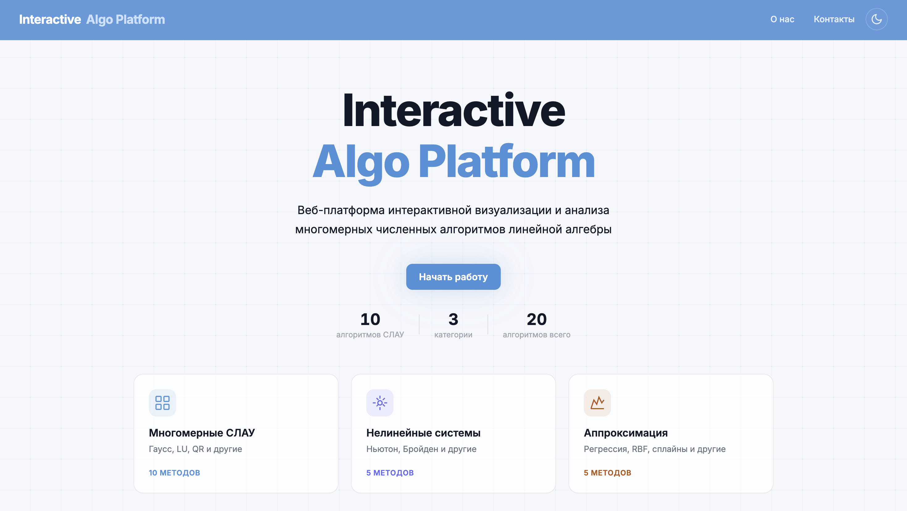
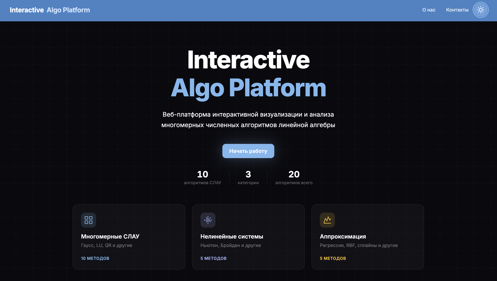
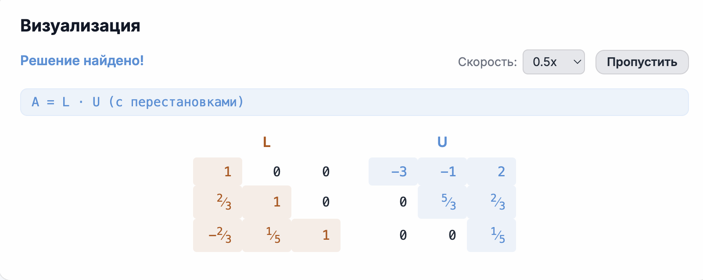
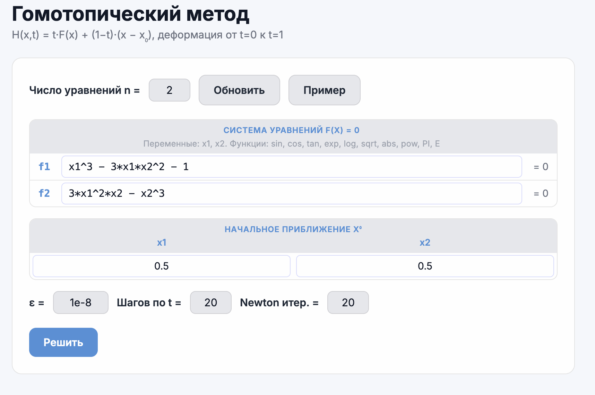

# Interactive Algo Platform

Веб-платформа для интерактивной визуализации и анализа многомерных численных алгоритмов линейной алгебры.

<p align="center">
  <picture>
    <source srcset="docs/screenshots/home-dark.png" media="(prefers-color-scheme: dark)">
    
  </picture>
</p>

<table align="center">
  <tr>
    <td width="50%" align="center">
      
      <br><sub><b>Светлая тема</b></sub>
    </td>
    <td width="50%" align="center">
      
      <br><sub><b>Тёмная тема</b></sub>
    </td>
  </tr>
</table>

## О проекте

Платформа собирает в одном месте 20 классических численных методов из трёх категорий и позволяет запускать их прямо в браузере с пошаговой визуализацией процесса решения.

- **Многомерные СЛАУ** — Гаусс, LU, QR, Холецкий, Якоби, Зейдель, SOR, MINRES, BiCG, GMRES
- **Нелинейные системы** — Ньютон, Бройден, простые итерации, гомотопический метод, продолжение по параметру
- **Аппроксимация и интерполяция** — линейная и полиномиальная регрессия, RBF, МНК, сплайны

## Возможности

<table>
  <tr>
    <td width="55%" valign="top">
      <h3>Пошаговая визуализация</h3>
      <p>Каждый метод показывает промежуточные состояния матриц, выделяет активные элементы и проигрывает решение с регулируемой скоростью.</p>
      
    </td>
    <td width="45%" valign="top">
      <h3>Гибкий ввод</h3>
      <p>Системы уравнений задаются прямо в интерфейсе, поддерживаются стандартные функции (sin, cos, exp, log, sqrt, …), готовые примеры и настройка параметров итераций.</p>
      
    </td>
  </tr>
</table>

## Стек

- React 19 + React Router 7
- Vite 8
- WebAssembly (OpenBLAS) для тяжёлых вычислений
- Canvas-визуализация и анимация интерфейса

## Запуск

```bash
npm install
npm run dev
```

### Сборка

```bash
npm run build
npm run preview
```

## Структура

```
src/
├── pages/ 
├── components/
│   ├── solver/  
│   └── ui/     
├── hooks/solvers/
│   ├── linear/   
│   ├── nonlinear/
│   └── approx/   
├── data/        
├── utils/
└── wasm/       
```
